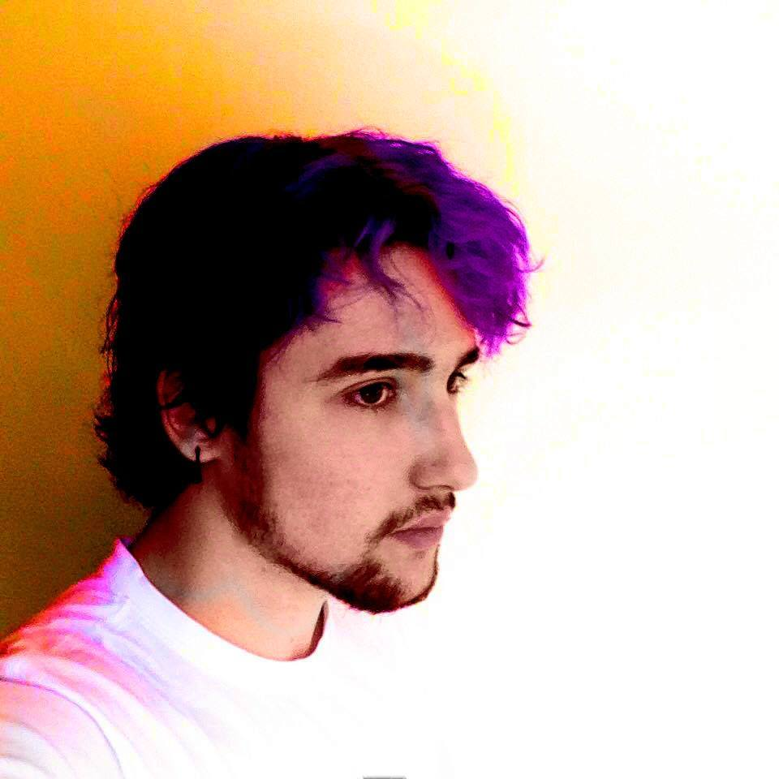
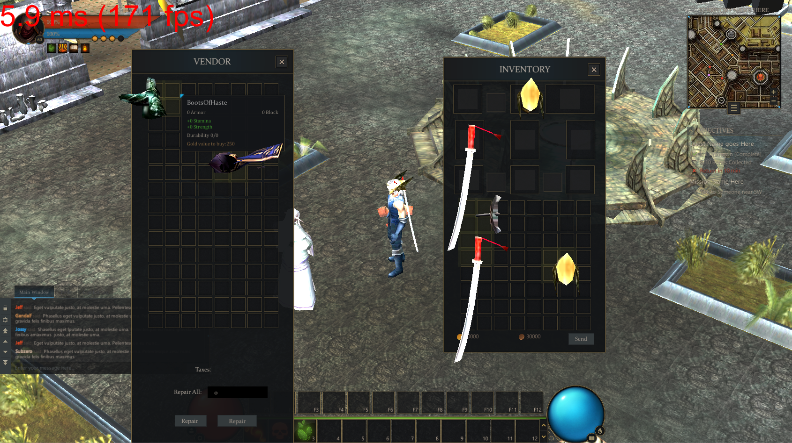
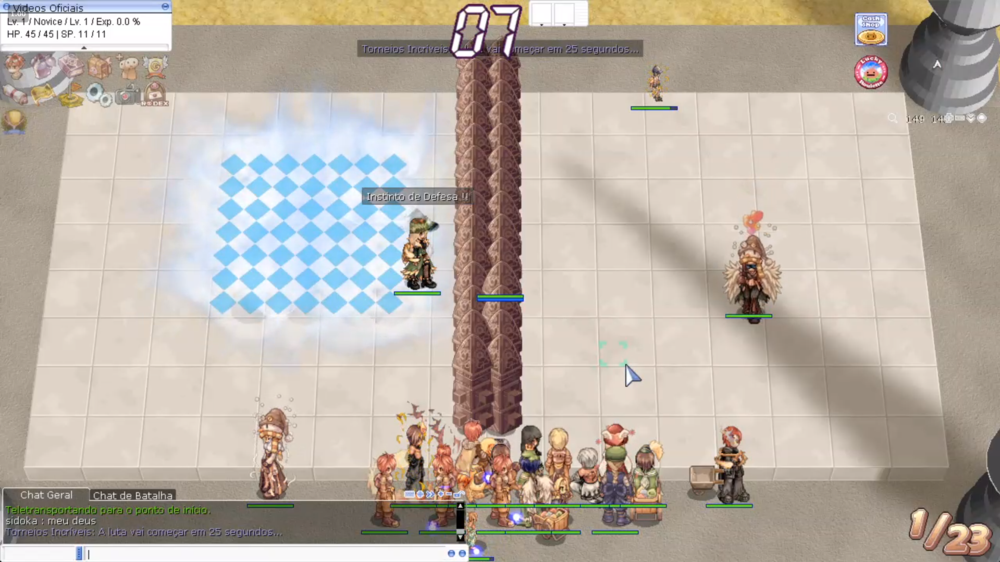
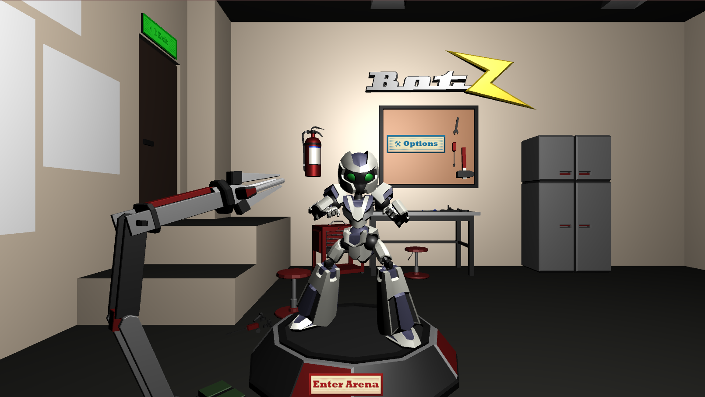
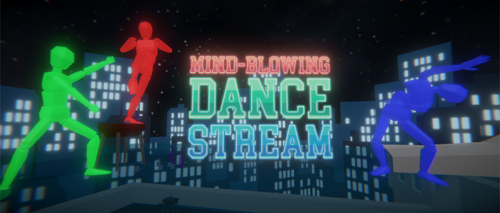
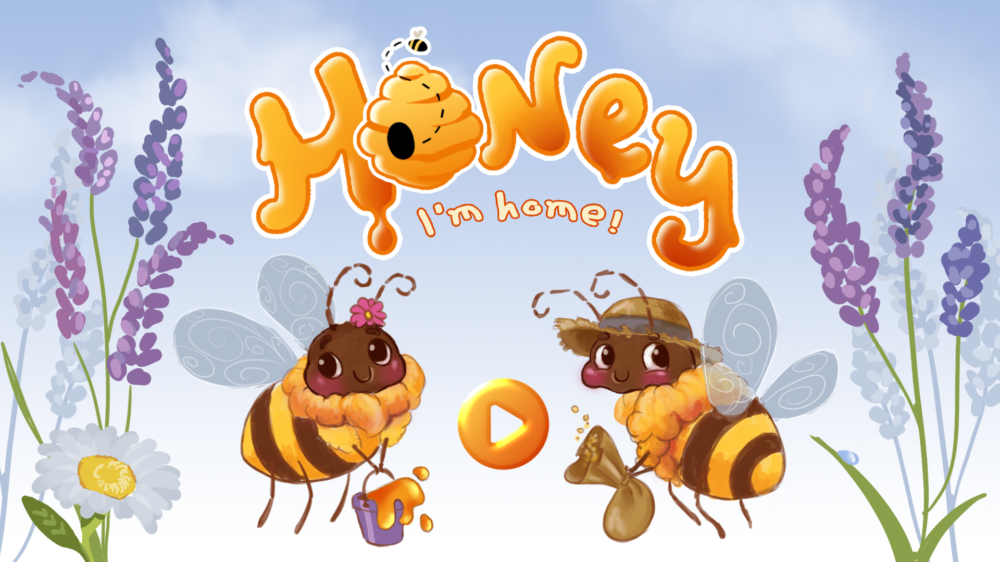
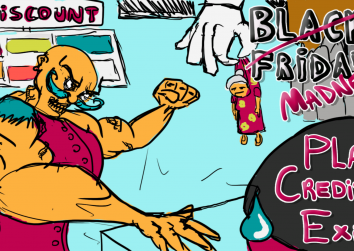
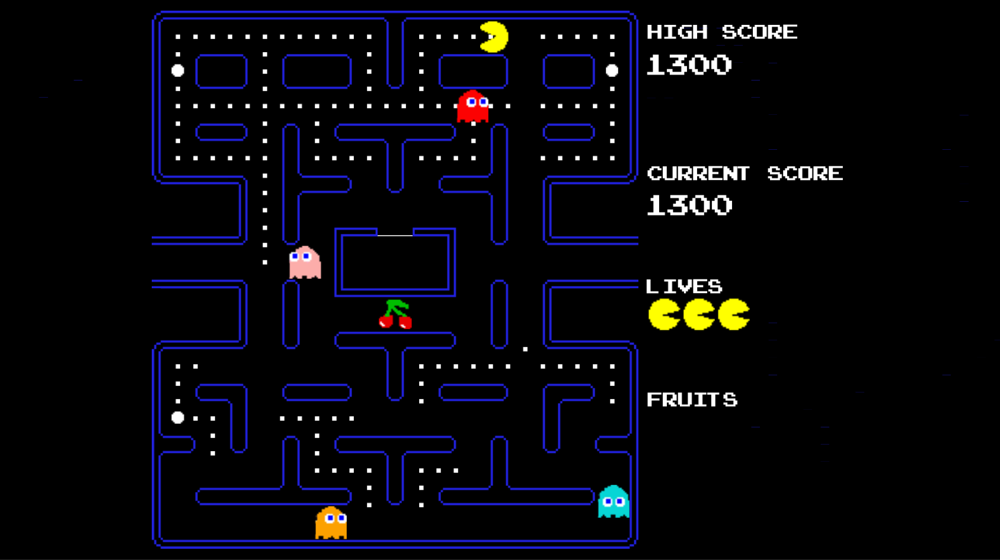
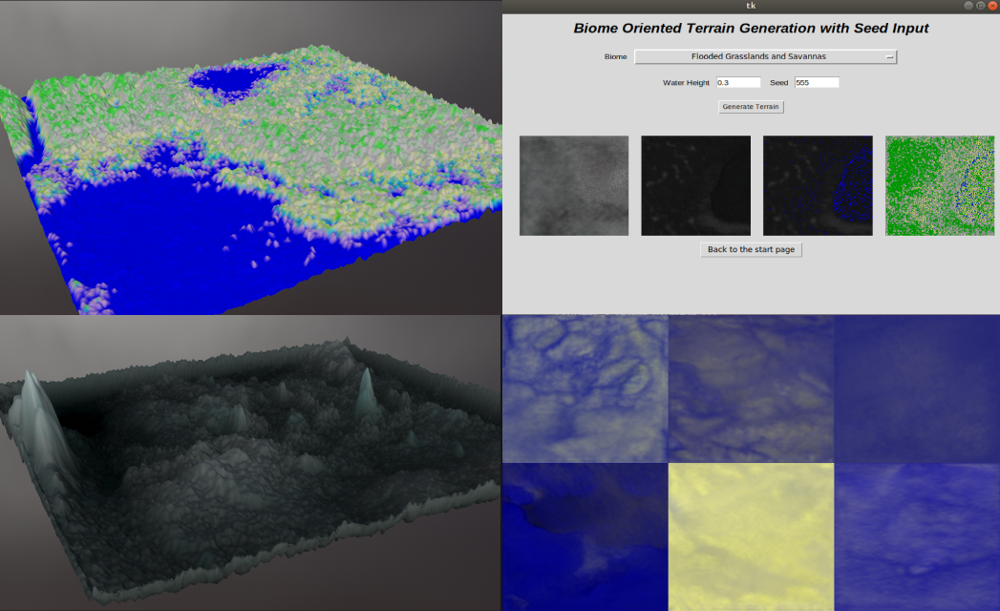

# Hello! My name is João Henz and I'm as game programmer!

I recently finished my Computer Science bachelor course  at UFRGS (1/2019).  I have 5+ years of experience in programming and have been a part of multiple sucessful game jam teams.

I also have a lot of experience with machine learning and procedural content generation. My Computer Science conclusion work was in the area of Procedural Terrain Generation via Machine Learning.
I love working with a team, coordinating our efforts and dealing with difficult programming challenges. I aspire to one day lead a game dev team.

Previous experience with
- C, C#, C++, Java, Python, html, javascript, PHP
- Unity, Gamemaker, Unreal Engine
- Google Drive, SourceTree, Git
- Agile Methodologies
- Very advanced english skills, native speaker of portuguese, moderate skills with german and basic skills in japanese

?

# Current Projects:
?Currently working with two companies from Porto Alegre. Both are small teams and work at distance:

## Software Developer at MegaDev: 
### October, 2019 -> Present
?In MegaDev I work with a team of 4 developers at a distance. This project involves the complete development of a MMORPG inspired by a classic of the genre using the Unity Engine. I am responsible for the almost all client related systems and we are in late stages of development, joining front and backend of the project.

Vendor NPC interaction
 ?

Combat with monsters and special skills usage?

## Software Developer at WorldRag / NewRO:
### December, 2019 -> Present
?I work with a team of 3 developers working at a distance in the WorldRag and Newro servers. I am responsible mainly for content creation - new dungeons, cities, instances and events. All of this is done using python, SQL and rAthena?'s script language. I have also been responsible for the implementation of multiple online features for the server's website using PHP and HTML.

The "Mysteries of Geffenia" was a series of dungeons connected to a bigger story driven event called "War Against Urheimur

The famous "King of Quests" event in the WorldRag and NewRO servers?

http://forum.newro.com.br/?
http://www2.worldrag.com/forum/?
https://www.twitch.tv/worldrag_oficial?

# Old projects:

BOTZ

MIND BLOWING DANCE STREAM - Best in the general category in Global Game Jam 2018 Unisinos by public vote

HONEY, I'M HOME! - Best game of Global Game Jam 2019 Unisinos by ADjogos RS choice

Black Friday Madness - Global Game Jam Unisinos 2017

Pacman - A small Pacman remake I made in Unity following closely the AI of the original game

Virtual Realistic and Large Terrain Generation via Machine Learning - My conclusion work for my Bachelor's Degree in Computer Science (UFRGS)

# Contact
[facebook.com/joaobatista.maniquehenz](https://www.facebook.com/joaobatista.maniquehenz)
[linkedin.com/joao-henz](https://www.linkedin.com/in/joao-henz/)
[github.com/SaintBallista](https://github.com/SaintBallista)
jmaniquehenz@gmail.com

