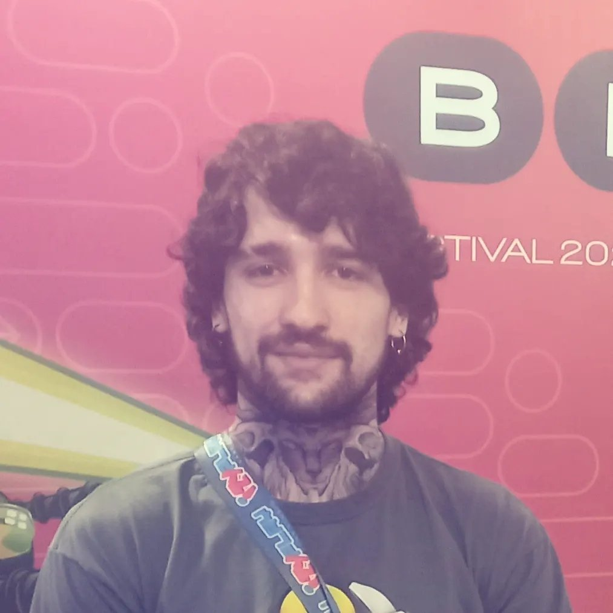

A software engineer hungry for knowledge and new challenges.

I've been working for three years in the game development industry and it is an area I have a deep appreciation for and I am always searching for new ways to grow in it. I am also a big fan of procedural generation and machine learning - my computer science conclusion work was in the area of Procedural Terrain Generation via Machine Learning. 

I love working with more people, coordinating our efforts and dealing with difficult programming challenges. In my experience leading teams, I am happy when I can optimize processes and enable the people inside it to better develop their skills.

I am currently working at Izyplay Game Studio in Porto Alegre.

Previous experience with
- C, C#, C++, Java, Python, html, javascript, PHP
- Unity, Gamemaker, Unreal Engine
- SourceTree, Git, Fork, XCode, Transporter, Android Studio
- Agile Methodologies, ClickUp, Trello
- AppStore, Google Play, web environments
- Very advanced english skills, native speaker of portuguese, moderate skills with german and basic skills in japanese

  

# Current Projects:

## Game Programmer at Izyplay Game Studio: 
### September, 2020 -> Present
Responsible for implementing gameplay features, translating requirements from the
game design team, sdk integrations, porting for web and other platforms. The company has a very fast pace, and I have worked in dozens of projects. I am also responsible for modelling game and networking systems for new projects. Here are some of the most notable projects I have worked on:

Adventure Miner - More than 3 million downloads on mobile, and a success on the web 
[- App Store](https://apps.apple.com/us/app/adventure-miner/id1570634510) 
[- Google Play](https://play.google.com/store/apps/details?id=com.izyplay.adventureminer) 
[- CrazyGames](https://www.crazygames.com.br/jogos/adventure-miner) 
  

Fisherman Life - Chosen by [RisingHigh Academy](https://www.linkedin.com/company/risinghigh/?lipi=urn%3Ali%3Apage%3Ad_flagship3_detail_base%3BrbRKRuEhR%2F6mqyPox%2FLP%2BA%3D%3D) as one of the 12 best of november 2021 
[- App Store](https://apps.apple.com/br/app/fisherman-life/id1592310424) 
[- Google Play](https://play.google.com/store/apps/details?id=com.izyplay.fishermanlife&hl=pt_BR&gl=US) 
  

# Old freelancer work:

## Software Developer at MegaDev: 
### October, 2019 -> October, 2020
In MegaDev I worked with a team of 4 developers at a distance. This project involved the
complete development of a MMORPG inspired by a classic of the genre using the Unity Engine. I
was responsible for almost all client related systems and we were in late stages of development,
joining front and backend of the project.

Vendor NPC interaction

Combat with monsters and special skills usage

## Software Developer at WorldRag / NewRO:
### December, 2019 -> October, 2020
I was responsible mainly for content creation - new dungeons, cities, instances and events. All of
this was done using python, SQL and a private script language. I have also been responsible for
the implementation of multiple online features for the server's website using PHP and HTML.

The "Mysteries of Geffenia" was a series of dungeons connected to a bigger story driven event called "War Against Urheimur"

The famous "King of Quests" event in the WorldRag and NewRO servers

[forum.newro.com.br](http://forum.newro.com.br) 
[worldrag.com/forum](http://www2.worldrag.com/forum) 
[twitch.tv/worldrag_oficial](https://www.twitch.tv/worldrag_oficial)   

# Other projects:

Knife Hit Remake - A simple gameplay remake of the Knife Hit game for Android focusing on code quality and the use of design patterns.
Check the Code at [github.com/JoaoHenz/KnifeHit](https://github.com/JoaoHenz/KnifeHit) 
[Download the APK](https://drive.google.com/file/d/12z6xP7POGXwoXhea6ZWLNv31R9EvQo5L/view?usp=sharing)  

MIND BLOWING DANCE STREAM - Best in the general category in Global Game Jam 2018 Unisinos by public vote
[globalgamejam.org/2018/games/mind-blowing-dance-stream](https://globalgamejam.org/2018/games/mind-blowing-dance-stream)  

HONEY, I'M HOME! - Best game of Global Game Jam 2019 Unisinos by ADjogos RS choice
[globalgamejam.org/2019/games/honey-im-home](https://globalgamejam.org/2019/games/honey-im-home)  

BOTZ
[quemnaojoga.itch.io/botz](https://quemnaojoga.itch.io/botz)  

 
 
Black Friday Madness - Global Game Jam Unisinos 2017
[globalgamejam.org/2017/games/black-friday-madness](https://globalgamejam.org/2017/games/black-friday-madness)  

Pacman - A small Pacman remake I made in Unity following closely the AI of the original game
[github.com/SaintBallista/pacmantest](https://github.com/SaintBallista/pacmantest)  

Virtual Realistic and Large Terrain Generation via Machine Learning - My conclusion work for my Bachelor's Degree in Computer Science (UFRGS) 
[lume.ufrgs.br/handle/10183/198604](https://lume.ufrgs.br/handle/10183/198604) 
[github.com/SaintBallista/styleterrain](https://github.com/SaintBallista/styleterrain)   

# Contact
[facebook.com/joaobatista.maniquehenz](https://www.facebook.com/joaobatista.maniquehenz) 
[linkedin.com/joao-henz](https://www.linkedin.com/in/joao-henz/) 
[github.com/JoaoHenz](https://github.com/JoaoHenz) 
jmaniquehenz@gmail.com
